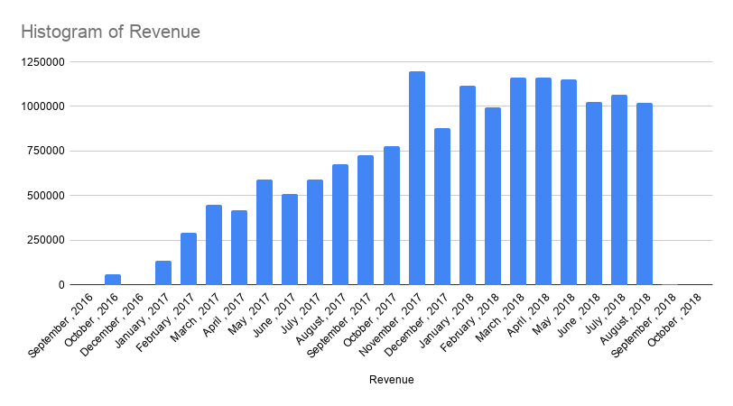

# Project Overview

**Project Title:** E-commerce Analysis (Olist Dataset)     
**Level:** Beginner     
**Dataset:** Olist Brazilian E-commerce Dataset      

---

## Description

This project is designed to showcase my SQL skills and the techniques used by data analysts to explore, clean, and analyze data in order to answer real-world business questions.

Using the Olist dataset, I performed data exploration, joined multiple tables, and extracted meaningful insights related to revenue, customer behavior, product performance, and delivery efficiency.

---

## Objectives

* Set up a database in MySQL using DBeaver
* Import and structure the Olist dataset into relational tables
* Perform exploratory data analysis (EDA)
* Join multiple tables to enable deeper analysis
* Answer key business questions using SQL

---

## Project Structure

### 1. Database Setup

* Created a new database: `ecommerce_project`
* Imported dataset tables using DBeaver import tools 

---

### 2. Data Exploration & Cleaning

* Checked for null values in key columns
* Ensured correct data types for analysis
* Joined tables to create a unified dataset for analysis

``` sql
CREATE DATABASE ecommerce_project;
USE ecommerce_project;

show databases;

show tables;
-- Joining tables
SELECT 
    o.order_id,
    o.customer_id,
    oi.product_id,
    oi.price,
    p.payment_value
FROM orders o
JOIN order_items oi 
    ON o.order_id = oi.order_id
JOIN order_payments p 
    ON o.order_id = p.order_id
LIMIT 10;
```
---

### 3. Data Analysis & Findings

The following business questions were explored:

* Total revenue generated
* Monthly sales trends
* Top customers by spending
* Best-selling products
* Delivery performance

---

### Total Revenue Generated

```sql
SELECT 
    ROUND(SUM(payment_value), 2) AS total_revenue
FROM order_payments;

```
``` **Output:**

total_revenue|
-------------+
  16008872.12|
```

---
  
### Monthly Sales Trend

```sql
SELECT 
    DATE_FORMAT(
        STR_TO_DATE(order_purchase_timestamp, '%Y-%m-%d %H:%i:%s'), 
        '%Y-%m'
    ) AS month,
    ROUND(SUM(p.payment_value), 2) AS revenue
FROM orders o
JOIN order_payments p 
    ON o.order_id = p.order_id
WHERE order_purchase_timestamp IS NOT NULL
GROUP BY 
    DATE_FORMAT(
        STR_TO_DATE(order_purchase_timestamp, '%Y-%m-%d %H:%i:%s'), 
        '%Y-%m'
    )
ORDER BY month;
```
``` **Output:**
month  |revenue   |
-------+----------+
2016-09|    252.24|
2016-10|  59090.48|
2016-12|     19.62|
2017-01| 138488.04|
2017-02| 291908.01|
2017-03|  449863.6|
2017-04| 417788.03|
2017-05| 592918.82|
2017-06| 511276.38|
2017-07| 592382.92|
2017-08| 674396.32|
2017-09| 727762.45|
2017-10| 779677.88|
2017-11| 1194882.8|
2017-12| 878401.48|
2018-01|1115004.18|
2018-02| 992463.34|
2018-03|1159652.12|
2018-04|1160785.48|
2018-05|1153982.15|
2018-06| 1023880.5|
2018-07|1066540.75|
2018-08|1022425.32|
2018-09|   4439.54|
2018-10|    589.67|
```

* Revenue increases steadily over months
* Peak observed in November , 2017

[](Charts/Revenue.png)

---

### Top Customers by Spending

``` sql
SELECT 
    o.customer_id,
    ROUND(SUM(p.payment_value), 2) AS total_spent
FROM orders o
JOIN order_payments p 
    ON o.order_id = p.order_id
GROUP BY o.customer_id
ORDER BY total_spent DESC
LIMIT 10;

```

```**Output:** 
customer_id                     |total_spent|
--------------------------------+-----------+
1617b1357756262bfa56ab541c47bc16|   13664.08|
ec5b2ba62e574342386871631fafd3fc|    7274.88|
c6e2731c5b391845f6800c97401a43a9|    6929.31|
f48d464a0baaea338cb25f816991ab1f|    6922.21|
3fd6777bbce08a352fddd04e4a7cc8f6|    6726.66|
05455dfa7cd02f13d132aa7a6a9729c6|    6081.54|
df55c14d1476a9a3467f131269c2477f|    4950.34|
e0a2412720e9ea4f26c1ac985f6a7358|    4809.44|
24bbf5fd2f2e1b359ee7de94defc4a15|    4764.34|
3d979689f636322c62418b6346b1c6d2|    4681.78|
```

* The analysis shows that a small number of customers contribute disproportionately to total revenue, highlighting the importance of high-value customers in driving business performance.
  
---

### Best-Selling Products

``` sql
SELECT 
    product_id,
    COUNT(*) AS total_sold
FROM order_items
GROUP BY product_id
ORDER BY total_sold DESC
LIMIT 10;
```

```**Output:**

product_id                      |total_sold|
--------------------------------+----------+
aca2eb7d00ea1a7b8ebd4e68314663af|       527|
99a4788cb24856965c36a24e339b6058|       488|
422879e10f46682990de24d770e7f83d|       484|
389d119b48cf3043d311335e499d9c6b|       392|
368c6c730842d78016ad823897a372db|       388|
53759a2ecddad2bb87a079a1f1519f73|       373|
d1c427060a0f73f6b889a5c7c61f2ac4|       343|
53b36df67ebb7c41585e8d54d6772e08|       323|
154e7e31ebfa092203795c972e5804a6|       281|
3dd2a17168ec895c781a9191c1e95ad7|       274|
```
---

## Delivery Performance

```sql
SELECT 
    AVG(
        DATEDIFF(
            STR_TO_DATE(order_delivered_customer_date, '%Y-%m-%d %H:%i:%s'),
            STR_TO_DATE(order_purchase_timestamp, '%Y-%m-%d %H:%i:%s')
        )
    ) AS avg_delivery_days
FROM orders
WHERE order_delivered_customer_date IS NOT NULL;
```
```**Output:**

avg_delivery_days|
-----------------+
          12.4973|
```
          
* The average delivery time is around 12.5 days, indicating a moderate delivery duration across orders

---

##  Findings

* Revenue is concentrated among a small group of customers
* Certain products dominate sales volume
* Sales show a consistent monthly trend
* Delivery times vary across orders, with an average of approximately two weeks, indicating moderate delivery efficiency.

---

## Conclusion


> This project showcases the practical use of SQL to analyze real-world e-commerce data and derive actionable business insights. By leveraging joins, aggregations, and structured queries, key patterns in revenue distribution, customer spending behavior, product performance, and delivery efficiency were identified. The findings emphasize the importance of data-driven decision-making in optimizing business operations and enhancing customer experience.

---

## References  

- [Olist Brazilian E-commerce Dataset (Kaggle)](https://www.kaggle.com/datasets/olistbr/brazilian-ecommerce)  
- MySQL Documentation  
- DBeaver  

---

## 👤 Author

**Krithik Vasan**      
[LinkedIn](https://www.linkedin.com/in/krithikvasans/)

